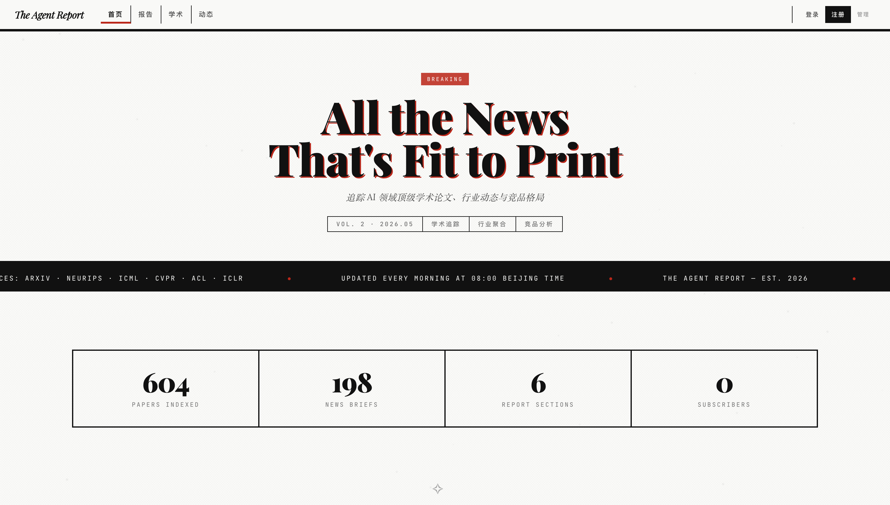
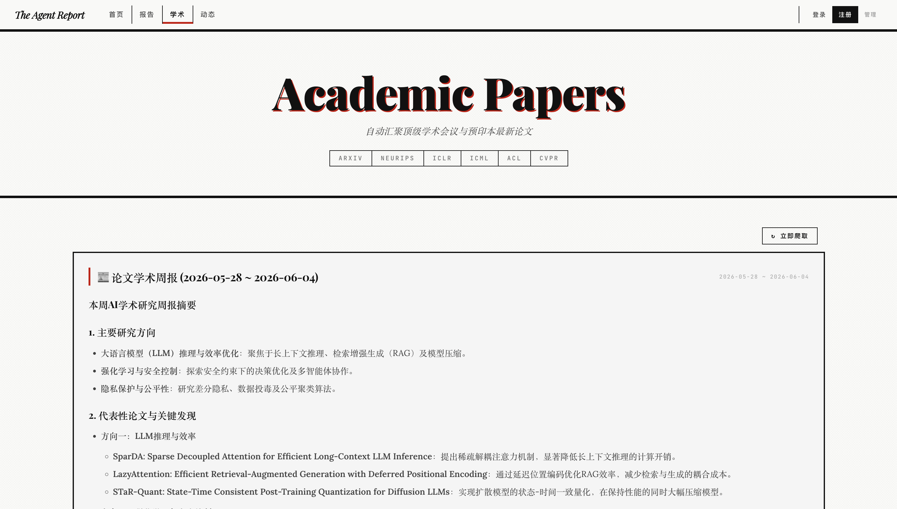
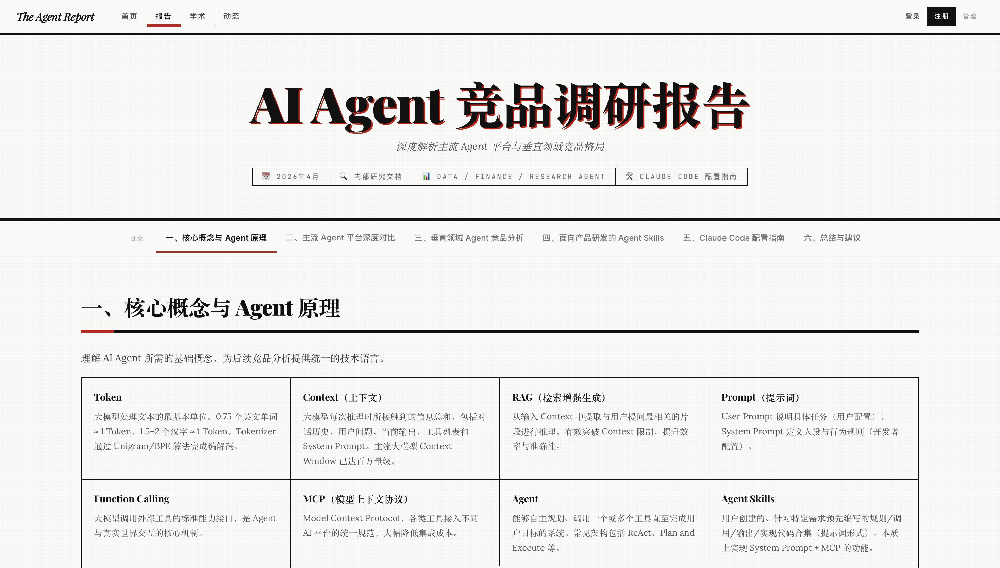

# The Agent Report

<div align="center">

**AI 行业情报聚合平台** | 自动追踪 · AI 摘要 · 竞品报告

[](https://python.org)
[](https://fastapi.tiangolo.com)
[](LICENSE)
[](docker-compose.yml)

</div>

---

## 这是什么

每天有大量 AI 论文、新闻、产品发布——**The Agent Report** 帮你自动聚合、筛选、总结。

- 不用切换 6 个平台刷论文 → **一个页面全量搜索**
- 不用每天读 RSS → **AI 帮你写周报摘要**
- 不用手动整理竞品信息 → **结构化报告随时查看**

**全部本地运行，数据不出电脑，零 API 费用。**

## 页面截图

| 首页 | 学术论文 | 行业动态 |
|:---:|:---:|:---:|
|  |  |  |

## 功能一览

| 模块 | 路径 | 做什么 |
|------|------|--------|
| 学术论文 | `/papers` | 追踪 arXiv、NeurIPS、ICLR、ICML、ACL、CVPR 最新论文，支持多来源筛选、日期范围、关键词搜索 |
| 行业动态 | `/news` | 聚合 36氪、量子位、ArXiv 等 RSS 源，自动更新 |
| 竞品报告 | `/report` | 6 大章节结构化竞品分析，CMS 后台管理 |
| AI 周报 | 自动生成 | 每周自动生成论文摘要 + 行业动态总结（类报纸 Bulletin Board） |
| 用户系统 | `/login` | 注册/登录/收藏论文/写笔记，可选登录 |

## 30 秒启动

```bash
git clone https://github.com/ColinWong13/AI-agent-upate.git
cd AI-agent-upate
./start.sh
```

脚本全自动：虚拟环境 → 依赖安装 → 数据库初始化 → 论文预爬取 → 浏览器打开。

**环境要求**：Python 3.11+，无需数据库（默认 SQLite）。

### 启用 AI 摘要

系统默认使用本地 Ollama，不产生任何费用：

```bash
# 安装 Ollama（macOS / Linux）
curl -fsSL https://ollama.com/install.sh | sh

# 拉取推荐模型（中文能力强，约 4.7GB）
ollama pull qwen2.5:7b
```

也可以切换到 OpenAI 兼容 API：

```bash
export LLM_PROVIDER=openai
export LLM_BASE_URL=https://api.openai.com/v1
export LLM_MODEL=gpt-4o-mini
export LLM_API_KEY=sk-xxx
```

### Docker 部署

```bash
docker compose up -d
# 启动 app + PostgreSQL + Redis + Ollama (GPU profile)
```

## 设计亮点

### 双层保险的 AI 周报

```
定时任务（每周日 20:00）  +  页面访问兜底检查
─────────────────────────────────────────────
如果定时任务漏了 → 用户打开页面时自动检测 → 同步生成 → 永远不漏
```

- 每次访问论文/动态页时检查本周是否有周报
- 如果没有（没生成过 or 漏了一周），自动触发 LLM 生成
- 周报新鲜时页面秒开，过期时自动补上
- LLM 不可用时优雅降级，不影响页面正常使用

### 并发爬虫 + 容错

6 个学术爬虫通过 `asyncio.gather` 并发执行，单个失败不影响其他。新闻爬虫全面采用 RSS（非 Web 爬取），可靠性大幅提升。

### Newspaper 设计风格

黑白红三色系统 + Playfair Display 标题字体 + 纸张纹理背景 + 直角边框，灵感来自传统报纸排版。

## 技术架构

```
┌───────────────────────────────────────┐
│  Jinja2 SSR Pages (12 templates)     │
├───────────────────────────────────────┤
│  FastAPI (main.py)                    │
│  ├─ HTML Routes (/)                   │
│  ├─ REST APIs (/api/*)                │
│  └─ Auth (JWT + bcrypt)              │
├──────────┬──────────┬─────────────────┤
│ Crawlers │ Services │ Scheduler       │
│ 7 modules│ LLM+Digest│ APScheduler    │
├──────────┴──────────┴─────────────────┤
│  SQLAlchemy 2.0 (Async)              │
├───────────────────────────────────────┤
│  SQLite / PostgreSQL  │  Ollama       │
└───────────────────────┴───────────────┘
```

## 项目结构

```
├── start.sh                # 一键启动
├── docker-compose.yml      # Docker 编排
├── requirements.txt        # Python 依赖
├── docs/                   # 产品需求 & 设计文档
└── backend/
    ├── main.py             # 应用入口 & 页面路由
    ├── config.py           # 配置中心
    ├── database.py         # 数据库引擎
    ├── auth.py             # JWT 认证
    ├── scheduler.py        # 定时任务
    ├── migrate.py          # 数据迁移
    ├── crawlers/           # 7 个爬虫
    │   ├── arxiv.py        #   arXiv API
    │   ├── neurips.py      #   NeurIPS
    │   ├── iclr.py         #   ICLR (OpenReview)
    │   ├── icml.py         #   ICML (PMLR)
    │   ├── acl.py          #   ACL Anthology
    │   ├── cvpr.py         #   CVPR
    │   └── news_crawler.py #   36氪 / 量子位 / ArXiv RSS
    ├── services/           # 业务逻辑
    │   ├── digest.py       #   AI 周报生成
    │   └── llm.py          #   LLM 调用封装
    ├── routers/            # REST API
    ├── models/             # 数据模型
    ├── templates/          # 12 个页面模板
    └── static/             # CSS
```

## 配置参考

```bash
cp .env.example .env
```

| 变量 | 默认值 | 说明 |
|------|--------|------|
| `USE_SQLITE` | `true` | SQLite 模式（零配置） |
| `LLM_PROVIDER` | `ollama` | `ollama` 或 `openai` |
| `LLM_BASE_URL` | `http://localhost:11434` | LLM 地址 |
| `LLM_MODEL` | `qwen2.5:7b` | 推荐模型 |
| `LLM_API_KEY` | — | OpenAI 模式才需要 |
| `JWT_SECRET` | — | 生产环境务必修改 |
| `CRAWL_INTERVAL_HOURS` | `6` | 新闻爬取间隔 |

## 技术栈

**后端** FastAPI + SQLAlchemy 2.0 + Jinja2 + APScheduler  
**数据库** SQLite（默认）/ PostgreSQL 15  
**AI** Ollama (qwen2.5:7b) / OpenAI 兼容 API  
**认证** JWT + bcrypt  
**部署** Docker Compose / 裸机 `start.sh`  
**前端** 服务端渲染 · Newspaper 风格 · 原生 CSS

## 文档

- [技术文档](docs/技术文档.md) — 架构设计、技术选型、实现思路、效果验证
- [产品文档](docs/产品文档.md) — 产品背景、功能介绍、设计亮点、未来规划
- [产品需求文档](docs/PRD_v2.5.0.md)
- [功能清单](docs/FeatureList_v2.0.md)

## 未来规划

- [ ] 学术爬虫优化（真实日期解析 + 新增 EMNLP/AAAI 等源）
- [ ] 行业动态源扩充（虎嗅、极客公园等）
- [ ] 视频资讯自动读取（Playwright + Whisper + AI 摘要）
- [ ] 报告 ↔ 学术 ↔ 动态三模块联动
- [ ] 全文搜索 · 邮件推送 · CI/CD · 测试覆盖

## License

[MIT](LICENSE) © 2026 The Agent Report
